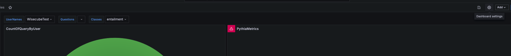
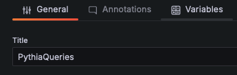
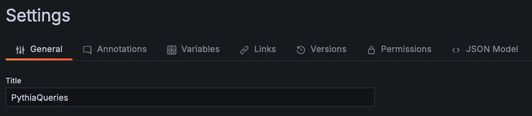
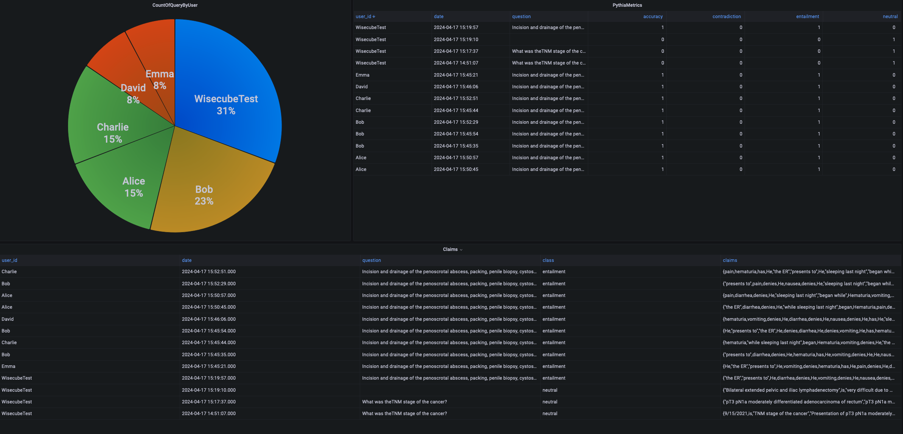

# wisecube-docker

### Run the Stack

1. Give execute permissions to `wisecube_install.sh`

```
chmod +x wisecube_install.sh
```
2. Run the install script with the `--install` command and after the openapi key is set will create all the require resources for the stack (network, volumes)

```
./wisecube_install.sh --install
```


### Clean up
To remove all the resources created run the script with the command `--uninstall`
```
./wisecube_install.sh --uninstall 
```

### Test
URL FOR DASHBOARDS `http://localhost:8000/grafana`

URL FOR API `http://localhost:8000/api/graphql`

#### Pythia query
```graphql
query askPythia($references: [String!], $response: String!, $question: String) {
  askPythia(references: $references, response: $response, question: $question)
}
```

vars
```
{
  "references": ["\nWJ Health Care\nAnatomic Pathology\n$21-14349\nOne Hospital Drive, Columbia, MO 65212\nPhone: (573) 882-1226 Fax. (573) 884-5948\nSURGICAL PATHOLOGY REPORT\n** FINAL **\nPatient:\nOperation Date:\n9/15/2021\nPatient ID: (am,\nAccession Date:\n9/16/2021\nService:\nGeneral Surgery Oncology\nSignout Date:\n9/21/2021\nLocation:\nOncology\nFacility:\nUniversity of MO Hospital (a\nAttending Physician:\nZihao Wu, M.D.\nDOB: ey\nOther Physician(s):\n{None Given}\nSex: GEE\nFINAL DIAGNOSIS:\n1. COLON AND OSTOMY, TAKEDOWN:\nBENIGN SKIN AND COLONIC TISSUE\nONE BENIGN LYMPH NODE (0/1)\n2. RECTUM AND ANUS, ABDOMINAL PERINEAL RESECTION:\nINVASIVE ADENOCARCINOMA, MODERATELY DIFFERENTIATED\nGREATEST DIMENSION INCLUDING TREATMENT EFFECTS - 4 CM\nADENOCARCINOMA INVADES THROUGH MUSCULARIS PROPRIA INTO PERICOLORECTAL TISSUE\nPARTIAL TREATMENT RESPONSE (SCORE 2)\nADENOCARCINOMA AND TREATMENT EFFECTS PRESENT AT CIRCUMFERENTIAL MARGIN\nONE OF NINETEEN LYMPH NODES, POSITIVE FOR ADENOCARCINOMA (1/19)\nPLEASE SEE ATTACHED TUMOR CHECKLIST FOR ADDITIONAL INFORMATION\n3. SOFT TISSUE, RIGHT ANTERIOR ADDITIONAL MARGIN, EXCISION:\nFOCALLY POSITIVE FOR ADENOCARCINOMA WITH ADJACENT TREATMENT EFFECTS\n4. SOFT TISSUE, RIGHT LATERAL SIDEWALL, EXCISION:\nFOCALLY POSITIVE FOR ADENOCARCINOMA WITH ADJACENT TREATMENT EFFECTS\nBy this signature, | attest that the above diagnosis is based upon my\npersonal examination of the tissue and slides (and/or other material indicated\nin the diagnosis), per policy. A resident was invoived in the pathologic\nevaluation of this case, | have reviewed and edited the findings of the\nresident.\nVan Thi Nguyen, M.D.\n** Electronically Signed Out **\nDiagnosis Comment\nSlides 2C and 2F: tumor at soft tissue circumferential margins.\nPage 1 of 4\n$21-14349\n$21-14349\na\nSpecimen(s) Received\n1: COLON AND OSTOMY\n2: ANUS AND RECTUM\n3: RIGHT ANTERIOR"],
  "response": "65 year old female presented with pT3 pN1a moderately differentiated adenocarcinoma of rectum on 9/15/2021.",
  "question": "What was theTNM stage of the cancer?"
}
```


### Dashboards
The grafana version that is use in the stack do not have the part with creation of new dashboards(maybe i have to look more into this) but i can use another docker that will connect to the same database and create there dashboards and use the json objects in the stack config.

Create working grafana (user and password are `admin`)
```
docker run -d -p 3000:3000 --name=grafana --network=wisecube-net grafana/grafana-oss
```

1. Add variables using the dashboard settings



2. Create visuals
3. Use the Json and save it under `grafana/dashboards`




### TODO
1. For the Moment the user are chose randm so we need to have a method to pass the user info( user_id, token etc.) to the java application
2. Enhance pythia app with error handling, finding references etc.
